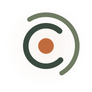

# 💡 Ember
> **The Digital Mirror — The Community Layer for Hotaru**

Ember is a hyper-local, utility-first standalone Progressive Web App (PWA) engineered as an **"anti-app."** It is completely stripped of algorithms, feeds, tracking loops, and infinite scrolling. Built entirely to protect user attention, its core architecture serves as a digital mirror: it surfaces real-world utility in seconds and immediately encourages users to close the screen and return to physical space.

## 🖼️ Interface & Architecture

Ember relies on a functional, zero-notification three-tier layout built to optimize immediate daily utility during a stay:

### 01 Home · Status
*   **The Philosophy:** Establishes soft, friction-free boundary awareness without invasive messaging loops.
*   **The Component:** Features a bold, minimalist serif greeting alongside a glowing, ambient Ember logo mark representing a contained radiance. Includes a 3-way horizontal tactile pill toggle (`Deep Work`, `Open`, `Offline`) paired with a text-only, avatar-free proximity ledger showing who is currently present in the space.

### 02 The Board
*   **The Philosophy:** A digital corkboard that completely clears its database every Sunday night to eliminate stale information rot.
*   **The Component:** A clean list of text-driven cards sorted strictly by three action tags: `[MAKING]`, `[OFFERING]`, and `[LOOKING]`. Designed to highlight mutual skills, slow loops, or local neighborhood events without metrics, likes, or public comment threads.

### 03 The Space Layer
*   **The Philosophy:** Fast, direct booking modeled after a traditional train timetable utility—zero reminder notifications, zero speculative slot hoarding.
*   **The Component:** A dead-simple static reservation grid mapping available and booked hourly intervals for property recovery elements (Sauna, Ice Bath, Meeting Rooms).

---

## 🎨 Visual System & Token Specifications

The application UI strictly inherits the premium, understated design identity of the Hotaru brand system:

<p align="center">
  
</p>

*   **Background (Coal):** `#1C1814` — Deep, low-stimulation dark mode tone.
*   **Elements (Sumi Green):** `#3A4A3F` — Muted, earthy structure bars.
*   **Accents (Ember Terracotta):** `#C06B3E` — A warm point of light for active states and indicators.
*   **Typography (Rice Cream):** `#F4EEE2` — High-contrast, gentle text visibility.
*   **Typefaces:** *Newsreader* for elegant editorial headings; *Hanken Grotesk* for utility labels, buttons, and logs.

---

## 🛠️ Local Development & Deployment

The codebase is built entirely with vanilla HTML, CSS, and JavaScript to load instantaneously over low-bandwidth environments.

```
ember/
├── index.html        # PWA shell & tab router
├── ember.css         # Zero-notification UI framework
├── manifest.json     # Application identity
├── sw.js             # Cache-first service worker
└── assets/
    ├── ember-logo.svg
    ├── icon-192.png
    └── icon-512.png
```

To launch a local sandbox environment:
```bash
cd /Users/navn33t/Documents/Active-Projects/ember
python3 -m http.server 8765
```

Then open [http://localhost:8765](http://localhost:8765) in your browser.

---

## Hotaru Brand Deck

The original Hotaru slide presentation lives at [`deck/index.html`](deck/index.html) for brand and investor walkthroughs.
